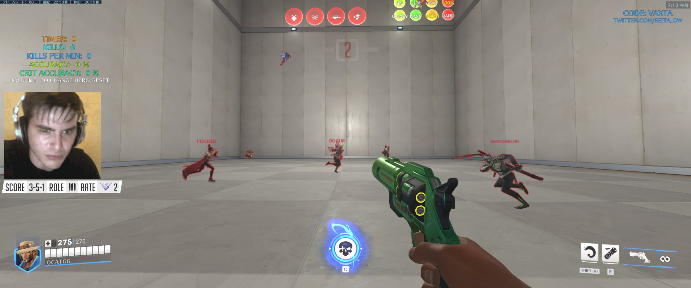

# ow-scoreboard-v2
[](https://github.com/Coordinate-Cat/ow-scoreboard-v2/actions/workflows/build.yaml)




## What is it ?

EN: OBS Studio app to display the current score of the popular game Overwatch.

JA: 大人気ゲーム、オーバーウォッチの現在のスコアを表示するための OBS Studio 用アプリです。

## How to install ?

### Windows

※ 旧[ow-scoreboard](https://github.com/Coordinate-Cat/ow-scoreboard)がローカルにある方はもう使わないのでアンインストールしてもらって構いません。

1. 下記ページから最新のリリースをダウンロードしてください。(例 `overwatch-scoreboard.exe`)

   - 最新リリース:
     https://github.com/Coordinate-Cat/ow-scoreboard-v2/releases/tag/hotfix-v0.0.1-2
     
2. ダウンロードしたファイルを解凍してください。
3. `overwatch-scoreboard.exe` を実行してください。
4. Windows によって PC が保護されましたと表示される場合は、「詳細情報」をクリックして実行してください。
5. インストールウィザードに従ってインストールしてください。
6. インストールが完了したら、デスクトップに `OverWatch Scoreboard` というショートカットが作成されます。
7. ショートカットをダブルクリックしてアプリを起動してください。
8. アプリが起動したら、OBS Studio で`ソース`の追加から`ウィンドウキャプチャ`を追加してください。
9. ウィンドウキャプチャの`プロパティ`で `OverWatch Scoreboard` を選択してください。
10. キャプチャ方法で `Windows 10(1903以降)` を選択してください。(※開発者の画面では必要な設定でした。)
11. 表示されたらスコアの部分だけを切り取りたいので、作った`ウィンドウキャプチャ`を右クリックして`フィルタ`を追加してください。
12. `エフェクトフィルタ`の追加で `カラーキー` を選択して緑の背景を透過してください。
13. これで透過したスコアボードの表示ができるようになります。
14. あとは切り抜き(ALT キー)等で大きさを調整してください。

## Develop

```
npm run tauri dev
```

## License

MIT License
